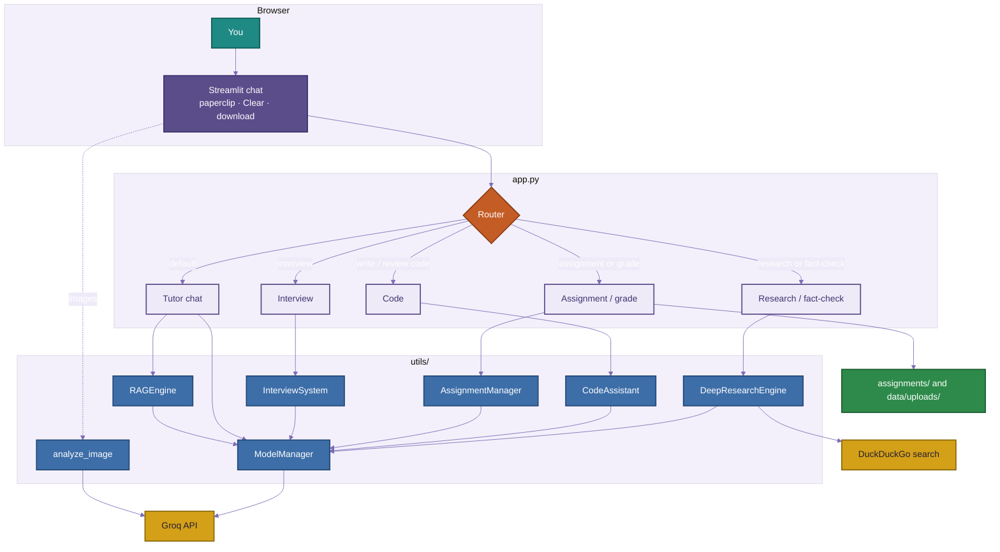
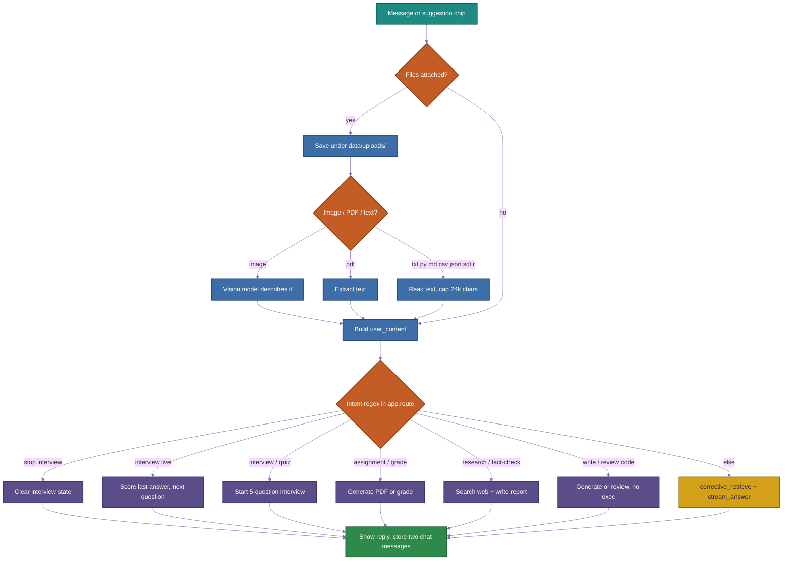
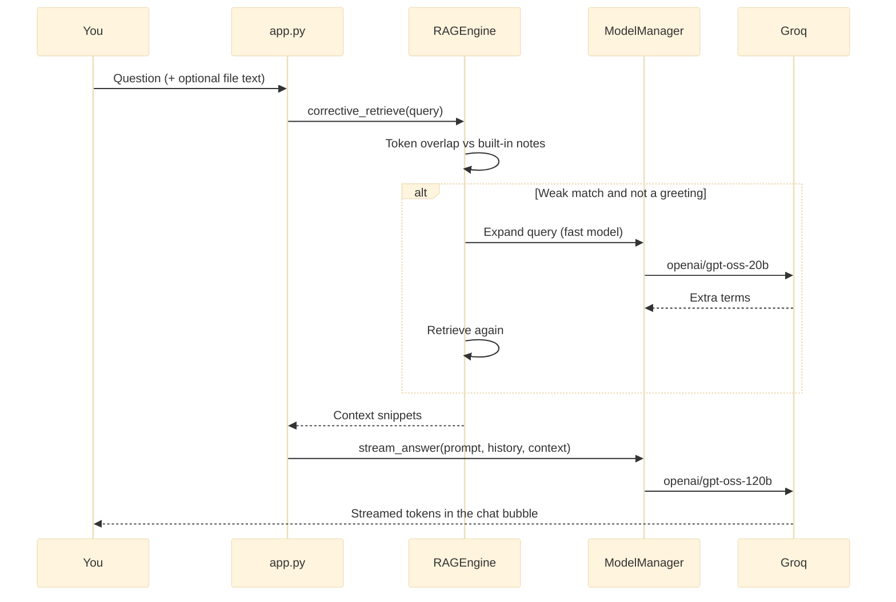
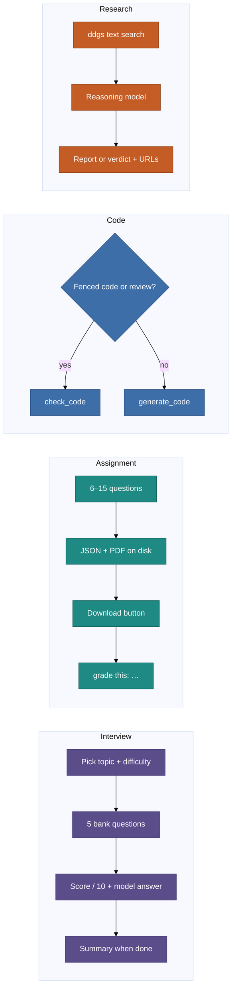

# Data Scientist BOT

A Streamlit tutor for **data science**, **machine learning**, **statistics**, **Python**, **generative AI**, and **agentic AI**.

You talk to one chat box. The app decides whether to answer from its knowledge base, run a mock interview, generate a graded assignment, write or review code, or search the web. There is **no login**. Conversation is saved locally to `data/chat_history.json` so it survives a refresh; **Clear** wipes it.

Made by **Himanshu**.

---

## What you can do

| Mode | How to start | What happens |
| --- | --- | --- |
| Tutor chat | Ask a normal question | Retrieval-augmented answer streamed from Groq |
| Mock interview | `Interview me on machine learning, beginner` | Five scored questions plus a model answer |
| Assignment | `Assignment on Python, intermediate, 8 questions` | Question set in chat and a PDF download |
| Grading | `grade this:` plus your answers | Scores the last generated assignment |
| Code | `Write a Python function that fills missing values` | Plan + code, or a review if you paste a fenced block |
| Research | `Research retrieval-augmented generation` | Web search, summary, and source links |
| Fact check | `Fact-check: transformers need labeled data` | Verdict plus a short explanation |
| Files | Paperclip in the message box | Images, PDF, and text-like files up to 50 MB |

Suggested starters on an empty chat:

- Explain the bias-variance tradeoff
- Interview me on machine learning, beginner
- Research retrieval-augmented generation
- Write a Python function that fills missing values

---

## Tech stack

| Layer | Choice |
| --- | --- |
| UI | Streamlit (`app.py`) |
| LLM API | Groq |
| Chat / reasoning / code | `openai/gpt-oss-120b` (reasoning, code) and `openai/gpt-oss-20b` (fast) |
| Vision | `qwen/qwen3.8-27b` |
| Knowledge | In-memory keyword retrieval in `utils/rag_engine.py` (no vector database) |
| Web search | `ddgs` (DuckDuckGo) |
| PDFs | ReportLab to write, pypdf to read |
| Secrets | `.env` locally, Streamlit secrets in the cloud |

Python **3.10+** (3.12 recommended).

---

## Repository layout

```text
Data_science_tutor/
├── app.py                 # UI, routing, session, files, streaming
├── requirements.txt
├── .env                   # GROQ_API_KEY (not committed)
├── utils/
│   ├── model_manager.py   # Groq client, model map, generate + stream
│   ├── rag_engine.py      # Built-in notes + corrective retrieve
│   ├── interview.py       # Question banks, scoring, summary
│   ├── assignment.py      # Question banks, PDF, grade from JSON
│   ├── code_assistant.py  # Generate / review code (does not run it)
│   ├── deep_research.py   # Search, research report, fact-check
│   ├── chat_history.py    # JSON save/load for conversation turns
│   └── image_recognition.py
├── assignments/           # Generated JSON + PDF (gitignored)
└── data/uploads/          # Saved attachments (gitignored)
```

There is **no** `auth.py` or SQLAlchemy database. Users are not stored.

---

## Architecture

The Streamlit process holds one `ModelManager` and one instance of each tool in `st.session_state`. Every user message goes through a **router**. Special intents skip RAG. Everything else is tutor chat: retrieve notes, then stream a completion.



### What each module owns

**`app.py`**  
Page chrome, CSS, `ensure_core()`, intent routing, file ingest, chat history in session, streaming display, assignment download button.

**`utils/model_manager.py`**  
Loads `GROQ_API_KEY` from `.env` or `st.secrets`. Maps roles `fast`, `reasoning`, `code`, and `vision` to Groq model ids. Builds the tutor system prompt, optional RAG context, and the last ~16 history turns. `stream_answer` is used for tutor chat; interviews, assignments, code, and research use non-streaming `generate` helpers.

**`utils/rag_engine.py`**  
A small built-in corpus (lifecycle, overfitting, metrics, RAG, agents, and similar). Retrieval is **TF-IDF-style keyword overlap**, not embeddings. `corrective_retrieve` can expand the query with the fast model if the first pass looks weak. Greetings skip retrieval.

**`utils/interview.py`**  
Topic banks at beginner / intermediate / advanced. Five questions per run. Each answer is scored 0–10 with strengths, gaps, and a model answer. `get_summary` finishes the round.

**`utils/assignment.py`**  
Builds a question list, writes `assignments/<id>.json` and a PDF, grades a submission against that JSON (or the in-session assignment). PDF extract uses pypdf when you attach a PDF.

**`utils/code_assistant.py`**  
Asks the code model for a plan and complete snippet, or a review. **Code is never executed** on the server.

**`utils/deep_research.py`**  
Searches the web, then asks the reasoning model for a report or a fact-check verdict.

**`utils/image_recognition.py`**  
Base64-encodes the image and calls the vision model so the caption can be appended to the user message.

---

## End-to-end request flow

This is the path for one message, including attachments.



### Router rules (order matters)

1. `stop interview` / `end interview` — leave interview mode.
2. An interview already running, and the text is **not** a new special intent — treat the message as an answer.
3. Words like `interview`, `quiz me`, `mock interview`.
4. `assignment`, `practice questions`, or a line starting with `grade`.
5. `fact-check`, or a line starting with `research` / `look up`.
6. A markdown code fence, or phrases like `write code`, `write a function`, `generate code`, `review this code`, `debug this`.
7. Otherwise tutor chat with RAG + streaming.

Interview topics are inferred from the prompt (`data science`, `machine learning` / `ml`, `generative` / `gen ai`, `agent`, `python`). Difficulty defaults to **intermediate** unless the text contains beginner or advanced.

---

## Tutor chat + RAG



History sent to the model is the last **12** user/assistant turns from `st.session_state.messages` (the manager itself will take up to 16). Attachments are merged into `model_content` so the model sees file text even if the visible bubble only shows your short prompt.

---

## Interview, assignment, code, research



Language for code is **Python** unless the prompt clearly asks for SQL or R.

---

## Session and files

- **Chat memory** is only `st.session_state`. Refresh or **Clear** wipes it. Nothing is written to SQLite.
- **Assignments** persist as JSON/PDF under `assignments/` so grading can reload by id.
- **Uploads** are copied to `data/uploads/` with a short UUID prefix.
- Images are shown in the thread at 280px width when the path still exists.

---

## Models

| Role | Model id | Used for |
| --- | --- | --- |
| `reasoning` | `openai/gpt-oss-120b` | Default tutor stream, interviews, assignments, research |
| `fast` | `openai/gpt-oss-20b` | Query expansion in RAG |
| `code` | `openai/gpt-oss-120b` | Code generate / review |
| `vision` | `qwen/qwen3.8-27b` | Image attachments |

You need a key from [console.groq.com](https://console.groq.com). Older Llama ids in comments (`llama-3.1-8b-instant`, `llama-3.3-70b-versatile`) were retired for developer accounts and are not used.

---

## Run locally

**1. Python 3.10+** (3.12 is a good default on Windows).

**2. Virtualenv and packages**

```bash
python -m venv venv
venv\Scripts\activate
pip install -r requirements.txt
```

On macOS/Linux: `source venv/bin/activate`.

**3. API key**

Create `.env` in the project root:

```
GROQ_API_KEY=your_key_from_https://console.groq.com
```

**4. Start**

```bash
streamlit run app.py
```

Open the local URL Streamlit prints (usually `http://localhost:8501`).

### `requirements.txt`

- `streamlit` — UI
- `groq` — LLM + vision
- `python-dotenv` — local secrets
- `Pillow` — image handling
- `ddgs` — web research
- `reportlab` — assignment PDFs
- `pypdf` — PDF text extract

---

## Deploy on Streamlit Community Cloud

1. Push this repository to GitHub.
2. Open [share.streamlit.io](https://share.streamlit.io) → **Create app**.
3. Repository: `Hisingh11/data-science-tutor`
4. Branch: `main`
5. Main file: `app.py`
6. **Advanced settings → Secrets**:

```toml
GROQ_API_KEY = "your_key_from_https://console.groq.com"
```

Cloud instances are ephemeral: `assignments/` and `data/uploads/` do not survive a reboot. Chat never did, because it is session-only.

---

## Limitations

- Retrieval is lexical over a **fixed** note set. It is not a vector store and does not index your PDFs into RAG (file text is only appended to that one turn).
- Web research depends on DuckDuckGo availability and is not a citation-perfect academic search.
- Code is generated or reviewed, never run. Do not treat it as executed output.
- Interview and assignment questions come from **hand-written banks**, not a fresh model exam unless the bank is extended in code.
- One Streamlit session = one interview / current assignment at a time.

---

## License / author

Personal tutor project by **Himanshu**. Use and fork as you like; add your own Groq key before running.
