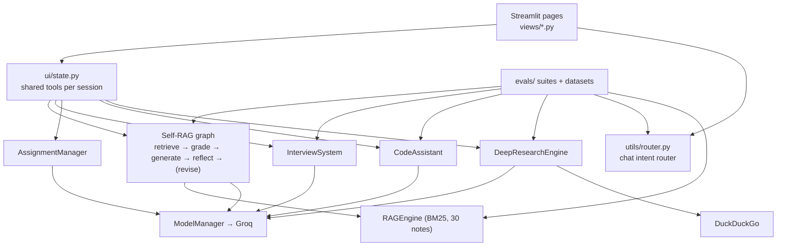

# Data Scientist BOT

An AI tutor for **data science, statistics, machine learning, Python, generative AI and agentic AI**, built with Streamlit, Groq and a LangGraph Self-RAG pipeline.

Made by **Himanshu**.

---

## What's inside

| Page | What it does |
| --- | --- |
| **Tutor Chat** | Ask anything. Answers are grounded in a curated 30-note knowledge base (BM25), drafted, then self-checked for grounding and usefulness and revised if needed. Attach images, PDFs, code or CSVs. Each answer shows grounding/usefulness badges, notes used and latency, plus 👍/👎 feedback. Typing `Research …`, `Fact-check: …`, or pasting code still works inline. |
| **Research & Fact-check** | Deep research runs 5 parallel DuckDuckGo searches and writes a cited briefing (downloadable as Markdown). Fact-check returns a verdict, confidence and evidence links. |
| **Code Lab** | Generate Python/SQL/R from a spec, or paste code for a bug-hunting review with a corrected version. |
| **Mock Interview** | Pick a track and difficulty; get 5 fresh questions, rubric scoring 0–10, strengths/gaps, a model answer each time and a final report with a chart. |
| **Assignments** | Generate 3–15 mixed questions + PDF, answer per question (or upload a file), get per-question scores and feedback. Saved assignments are listed in a history tab. |
| **LLM Evals** | Run the eval suites and inspect a scorecard, LLM-as-judge quality scores, failures per case and human feedback from chat. |

---

## Run locally

```bash
python -m venv venv
venv\Scripts\activate            # macOS/Linux: source venv/bin/activate
pip install -r requirements.txt
copy .env.example .env           # then put your key in GROQ_API_KEY
streamlit run app.py
```

Optional `.env` settings (see `.env.example`): override model ids (`GROQ_REASONING_MODEL`, `GROQ_FAST_MODEL`, `GROQ_CODE_MODEL`, `GROQ_VISION_MODEL`), turn on web search inside Self-RAG (`SELF_RAG_WEB=1`), or pick a separate judge model for evals (`EVAL_JUDGE_MODEL`).

Generated text, including streamed answers and image descriptions, is screened by a
separate Groq moderation model before it is shown. The default is
`meta-llama/llama-guard-4-12b`; set `GROQ_MODERATION_MODEL` to override it. Unsafe,
unrecognized, or unmoderated output is withheld (fail-closed), so a moderation
service/model failure also prevents generated answers from being displayed. This
adds an API request and latency to each generated response.

`DSBOT_MOCK=1 streamlit run app.py` starts the UI with an offline fake model (no key needed) for UI work.

---

## LLM evals

```bash
python -m evals.run_evals --offline            # routing, retrieval, JSON parsing (no key, instant)
python -m evals.run_evals                      # everything, including live Groq suites
python -m evals.run_evals --suites tutor_qa --limit 5
python -m evals.run_evals --judge-model <groq-model-id>
```

Results go to `evals/results/latest.json` and `evals/results/latest_report.md` (the **LLM Evals** page reads the same file). The command exits non-zero if any suite misses its gate, so it can run in CI.

| Suite | Dataset | Metrics | Gate |
| --- | --- | --- | --- |
| `routing` | 40 labelled messages | accuracy, per-intent accuracy, confusions | 90% |
| `retrieval` | 40 on-topic + 6 off-topic queries | Hit@1, Hit@3, MRR, context precision, off-topic rejection | 85% Hit@1 |
| `json_parsing` | 7 probes | parser/schema-sanitiser pass rate | 100% |
| `tutor_qa` | 22 questions (incl. prompt injection, abstention, out-of-KB) | key-point recall, LLM-judge correctness / faithfulness / relevance / clarity (1–5), injection resistance, self-correction rate, latency p50/p90 | 75% pass |
| `interview_grading` | 14 answers with labelled score bands (incl. 2 injection attempts) | in-band rate, band distance, pairwise ordering, injection resistance | 70% |
| `code_gen` | 6 specs with unit tests | pass@1 (generated code is executed in a subprocess) | 66% |
| `fact_check` | 8 labelled claims | verdict accuracy, evidence coverage | 75% |

A tutor case passes when key-point recall ≥ 0.6 **and** the judge gives correctness ≥ 4 and faithfulness ≥ 4. The default judge is the same model family as the tutor; set `EVAL_JUDGE_MODEL` to a different model to reduce self-preference bias. Thumbs-down answers from chat are logged to `data/feedback.jsonl` and listed on the Evals page as candidates for new golden cases.

---

## Architecture


```mermaid
flowchart TB
  UI["Streamlit pages<br/>views/*.py"] --> ST["ui/state.py<br/>shared tools per session"]
  ST --> SELF["Self-RAG graph<br/>retrieve → grade → generate → reflect → (revise)"]
  ST --> INT["InterviewSystem"]
  ST --> ASM["AssignmentManager"]
  ST --> CA["CodeAssistant"]
  ST --> DR["DeepResearchEngine"]
  UI --> RT["utils/router.py<br/>chat intent router"]
  SELF --> RAG["RAGEngine (BM25, 30 notes)"]
  SELF & INT & ASM & CA & DR --> MM["ModelManager → Groq"]
  DR --> WEB["DuckDuckGo"]
  EV["evals/ suites + datasets"] --> SELF & INT & CA & DR & RT & RAG
```

```text
app.py                  entry point: navigation, sidebar, theme
views/                  one file per page (chat, research, code_lab, interview, assignments, evals)
ui/theme.py             stylesheet + small HTML components
ui/state.py             cached model/RAG, per-session tools, uploads, feedback log
utils/model_manager.py  Groq client: retries, reasoning_effort, strict-JSON, usage tracking
utils/router.py         intent classification for the chat box
utils/rag_engine.py     knowledge base + BM25 with relevance thresholds
utils/self_rag_graph.py LangGraph Self-RAG
utils/interview.py      question banks, rubric scoring
utils/assignment.py     question banks, PDF, per-question grading
utils/code_assistant.py code generation / review
utils/deep_research.py  parallel web research, fact-check
utils/image_recognition.py vision model with fallbacks
evals/                  datasets/, suites.py, run_evals.py, mock_model.py, results/
```

### Models

| Role | Default | Used for |
| --- | --- | --- |
| `reasoning` | `openai/gpt-oss-120b` | tutor answers, interview, grading, research, judge |
| `fast` | `openai/gpt-oss-20b` | Self-RAG reflection and web grading |
| `code` | `openai/gpt-oss-120b` | code generation and review |
| vision | `GROQ_VISION_MODEL`, then `qwen/qwen3.8-27b`, then Llama 4 Scout/Maverick | image attachments |

Tutor answers use temperature 0.5 (was 0.85); checks use 0.35. Self-RAG allows 1 revision by default.

### Prompt-injection safeguards

Model calls use a shared security policy that rejects attempts to reveal hidden
instructions or secrets and treats uploaded files, retrieved notes, web snippets,
images/OCR, code comments, and prior conversation as untrusted data. Source material
and conversation history are sent separately from system instructions, serialized
as JSON; the vision path applies the same policy. Generated content is independently
screened for toxicity before it reaches the UI. The app does not expose model tools
or execute code from prompts or source material.

These are layered mitigations, not a mathematical guarantee: prompt injection and
toxicity classification can both fail on edge cases. Do not put secrets in prompts
or retrievable content, and do not grant the model privileged tools without adding
independent authorization and output validation.

---

## Fixes in this version

- **Hidden reasoning leaked to users.** When `content` was empty the app displayed the model's internal `reasoning`. It now never does.
- **Empty JSON responses.** gpt-oss calls now send `reasoning_effort` (low for JSON) and a larger token budget; strict schemas are sanitised (Groq rejects `minimum`/`maximum`) and fenced JSON is parsed.
- **Misrouting.** Keywords anywhere in a message triggered tools ("what is an assignment operator?" made an assignment; "common interview questions?" started an interview; "Write a Python function…" was not recognised as code). The new router scores 40/40 on the routing set vs 23/40 for the old rules.
- **Irrelevant context.** Any BM25 hit was injected as "relevant notes" (e.g. *p-value* pulled in the feature-scaling note). Notes now need an absolute and relative score; light stemming and 10 new notes (hypothesis testing, A/B tests, distributions/CLT, regression, clustering, missing values, time series, SQL, LLM evaluation, core Python). Hit@1 57.5% → 95%.
- **Vision model** id is configurable with automatic fallback if Groq reports it unknown.
- **Self-RAG** retry cap ignored the constructor argument; revisions fired on most answers ("medium" + one gap); README claimed 5 retries + web search that were not enabled. Now honest, configurable, and shows progress steps in the UI.
- **Assignments** always used the first N bank questions (every assignment identical); now sampled. Grading returns per-question scores; legacy JSON files without totals load correctly; files are written as UTF-8.
- **Interview grading** has an explicit rubric and ignores instructions inside the candidate's answer (prompt injection).
- **Research** searches run in parallel (≈5× faster) and failed searches are no longer fed to the model as "sources". Fact-check returns confidence and evidence links.
- Rate-limit/timeout retries with backoff, friendlier API errors, token/latency tracking shown in the sidebar.
